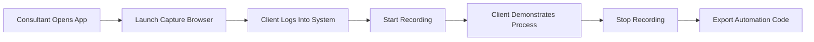

# Browser Context Capture - Developer Guide 🌐

## Overview
This guide explains how to use Process Capture Studio's browser context capture feature to record web application workflows with full DOM element information.

## Table of Contents
- [Quick Start](#quick-start)
- [Expected Workflow](#expected-workflow)
- [What Gets Captured](#what-gets-captured)
- [Testing Your Capture](#testing-your-capture)
- [Troubleshooting](#troubleshooting)
- [Technical Details](#technical-details)

---

## Quick Start

### 1. Launch Process Capture Studio
```bash
npm start
```

### Permissions
Macos- if running in VS Code - need to give permission to in 2 areas
- for Enhanced need screen recording
- 

### 2. Click "🌐 Launch Capture Browser"
- A new Chrome window opens with debugging enabled
- Status indicator changes to: **🟢 Browser: Enhanced Capture Active**

### 3. Navigate to Your Web App
- Use the launched Chrome to go to any website
- Log into your web applications
- This is a clean profile - no personal data

### 4. Start Recording
- Click **"Start Capture"** in Process Capture Studio
- Status shows: **Recording...**

### 5. Perform Your Workflow
- Click buttons, fill forms, navigate pages
- Each action captures DOM elements, not just coordinates

### 6. Stop and Export
- Click **"Stop"** when done
- Click **"Export"** to generate automation code

---

## Expected Workflow

### Consultant + Client Session



### Step-by-Step Process

#### Step 1: Initial Setup (Consultant)
1. Open Process Capture Studio
2. Click **"🌐 Launch Capture Browser"**
3. Wait for status: **🟢 Enhanced Capture Active**

#### Step 2: Client Login
1. Client uses the launched Chrome browser
2. Navigate to their web application (CRM, ERP, etc.)
3. Log in with their credentials
4. Navigate to starting point of process

#### Step 3: Recording Process
1. Click **"Start Capture"** in Process Capture Studio
2. Client performs their normal workflow:
   - Fill out forms
   - Click buttons
   - Navigate between pages
   - Copy/paste data
3. Use **Ctrl+Shift+M** to mark important steps

#### Step 4: Review & Export
1. Click **"Stop"** to end recording
2. Review captured steps in activity feed
3. Click **"Export"** and choose format:
   - Playwright (recommended for web)
   - Selenium
   - Documentation

---

## What Gets Captured

### Without Browser Context (Basic Mode) ❌
```javascript
{
  type: "click",
  x: 450,
  y: 320,
  application: "Google Chrome"
}
```
**Problem**: Coordinates break when screen size changes

### With Browser Context (Enhanced Mode) ✅
```javascript
{
  type: "click",
  element: {
    selectors: {
      css: "button#submit-order",
      xpath: "//button[@id='submit-order']",
      text: "Submit Order"
    },
    tag: "button",
    type: "submit",
    attributes: {
      id: "submit-order",
      class: "btn btn-primary",
      name: "submitBtn"
    }
  },
  pageContext: {
    url: "https://app.example.com/orders/new",
    title: "Create Order - Example App"
  }
}
```
**Benefit**: Selectors work regardless of screen size or layout changes

---

## Testing Your Capture

### Test Scenario: Form Submission

1. **Launch Capture Browser**
2. **Navigate to a form** (e.g., Google Forms, Contact Form)
3. **Start Recording**
4. **Perform Actions**:
   - Click form fields
   - Type text
   - Select dropdowns
   - Click submit

5. **Check Activity Feed**:
   You should see:
   ```
   ✅ Clicked "#firstName" input field
   ✅ Typed "John" in First Name field
   ✅ Clicked "#lastName" input field  
   ✅ Typed "Smith" in Last Name field
   ✅ Clicked "button.submit" Submit button
   ```

6. **Export as Playwright**:
   ```javascript
   // Generated code should use selectors:
   await page.click('#firstName');
   await page.fill('#firstName', 'John');
   await page.click('#lastName');
   await page.fill('#lastName', 'Smith');
   await page.click('button.submit');
   ```

### Test with Popular Web Apps

#### Gmail
1. Launch capture browser
2. Login to Gmail
3. Record composing an email
4. Export should capture:
   - Compose button selector
   - To/Subject/Body field selectors
   - Send button selector

#### Salesforce/CRM
1. Launch capture browser
2. Login to CRM
3. Record creating a new contact
4. Export should capture:
   - Navigation menu selectors
   - Form field selectors
   - Save button selector

#### E-commerce Admin
1. Launch capture browser
2. Login to admin panel
3. Record adding a product
4. Export should capture:
   - Product form fields
   - Image upload button
   - Publish button selector

---

## Troubleshooting

### Issue: "🔴 Browser: Basic Capture Only"

**Cause**: Browser not connected with debugging port

**Solution**:
1. Click **"Launch Capture Browser"** again
2. Wait for Chrome to fully load
3. Check status indicator turns green

### Issue: Still Capturing Coordinates

**Symptoms**: Activity shows "Clicked at 234, 567" instead of element names

**Solutions**:
1. Ensure you're using the launched Chrome (not your regular browser)
2. Check console for errors:
   - Open DevTools in Process Capture Studio (Ctrl+Shift+I)
   - Look for browser worker errors
3. Restart the app and try again

### Issue: Browser Launches But Doesn't Connect

**Solutions**:
1. Kill any existing Chrome with debugging:
   ```bash
   pkill -f "remote-debugging-port=9222"
   ```
2. Try manual launch:
   ```bash
   open -a "Google Chrome" --args --remote-debugging-port=9222
   ```
3. Check if port 9222 is blocked by firewall

### Issue: Can't Login to Web App

**Note**: The capture browser uses a clean profile

**Solutions**:
1. Save passwords when prompted
2. Use password manager extension (install in capture browser)
3. Keep credentials handy for manual entry

---

## Technical Details

### Architecture

```
Process Capture Studio
├── Main Process (Electron)
│   ├── Spawns Browser Worker
│   └── Handles IPC Communication
│
├── Browser Worker (Node.js)
│   ├── Runs Playwright
│   └── Connects to Chrome via CDP
│
└── Capture Browser (Chrome)
    ├── Debugging Port: 9222
    └── Clean Profile: /tmp/chrome-capture-profile
```

### Chrome DevTools Protocol (CDP)

The browser worker connects to Chrome using CDP to:
- Execute JavaScript in page context
- Get element at coordinates
- Extract selectors and attributes
- Monitor page navigation

### Data Flow

1. **User clicks in browser** → 
2. **uiohook captures coordinates** → 
3. **Main process receives click event** → 
4. **Requests element from browser worker** → 
5. **Worker queries Chrome via CDP** → 
6. **Returns element selectors** → 
7. **Activity enriched with DOM data** → 
8. **Displayed in UI with selectors**

### Generated Code Examples

#### Playwright Export
```javascript
const { chromium } = require('playwright');

(async () => {
  const browser = await chromium.launch();
  const page = await browser.newPage();
  
  // Navigate to starting page
  await page.goto('https://app.example.com/login');
  
  // Login flow
  await page.fill('#username', 'user@example.com');
  await page.fill('#password', 'password');
  await page.click('button[type="submit"]');
  
  // Wait for dashboard
  await page.waitForSelector('.dashboard');
  
  // Perform captured workflow
  await page.click('a[href="/orders/new"]');
  await page.fill('#customer-name', 'John Smith');
  await page.selectOption('#product', 'Widget-A');
  await page.click('button#submit-order');
  
  await browser.close();
})();
```

#### Selenium Export
```python
from selenium import webdriver
from selenium.webdriver.common.by import By

driver = webdriver.Chrome()

# Navigate to starting page
driver.get('https://app.example.com/login')

# Login flow
driver.find_element(By.ID, 'username').send_keys('user@example.com')
driver.find_element(By.ID, 'password').send_keys('password')
driver.find_element(By.CSS_SELECTOR, 'button[type="submit"]').click()

# Perform captured workflow
driver.find_element(By.CSS_SELECTOR, 'a[href="/orders/new"]').click()
driver.find_element(By.ID, 'customer-name').send_keys('John Smith')
driver.find_element(By.ID, 'product').send_keys('Widget-A')
driver.find_element(By.ID, 'submit-order').click()

driver.quit()
```

---

## Best Practices

### 1. Always Use Capture Browser
- Don't use your personal Chrome
- Launch fresh for each session
- Ensures clean capture environment

### 2. Mark Important Steps
- Press **Ctrl+Shift+M** before critical actions
- Describe what you're about to do
- Helps with documentation generation

### 3. Wait for Page Loads
- Let pages fully load before clicking
- Ensures elements are captured correctly
- Reduces timing issues in exported code

### 4. Test Exported Code
- Run generated automation immediately
- Verify selectors work correctly
- Adjust timing if needed

### 5. Handle Dynamic Content
- For SPAs (React, Angular, Vue):
  - Wait longer between actions
  - Mark steps that load dynamic content
  - May need manual wait additions in exported code

---

## Example Use Cases

### 1. Order Processing Workflow
- Login to e-commerce admin
- Navigate to orders
- Process refund
- Send customer email
- Update inventory

### 2. CRM Data Entry
- Create new contact
- Add company information
- Set follow-up tasks
- Generate quote
- Send proposal

### 3. Report Generation
- Login to analytics platform
- Set date ranges
- Apply filters
- Export data
- Format in spreadsheet

### 4. Customer Support Ticket
- Open ticket system
- Search customer
- Update ticket status
- Add internal notes
- Send response

---

## Next Steps

1. **Try a simple capture** with a public form
2. **Test with your web app** to see real selectors
3. **Export and run** the generated code
4. **Share feedback** on what could be improved

Remember: The browser context capture transforms fragile coordinate-based recordings into robust selector-based automation that actually works in production!

---

## Support

- **Console Logs**: Check DevTools console for detailed capture info
- **Activity Feed**: Shows exactly what was captured
- **Export Preview**: Review generated code before saving
- **Test Scripts**: Use test-browser-worker.js for diagnostics

Happy capturing! 🎯
